Templates:
https://docs.aws.amazon.com/AWSCloudFormation/latest/UserGuide/template-formats.html

IAM roles:
https://docs.aws.amazon.com/AWSCloudFormation/latest/TemplateReference/aws-resource-iam-role.html

## Create a user with no permissions
- Create a user with no permissions and get access key and secrets
https://docs.aws.amazon.com/cli/latest/reference/iam/create-user.html
```sh
aws iam create-user --user-name sts-machine-user
```
```sh
aws iam create-access-key --user-name sts-machine-user
```

Copy the access key and secrets here and then change the credentials file to not use the default one anymore.

```sh
aws configure
```

## Edit credential file to stay away from default profile
```sh
aws sts get-caller-identity --profile sts
```

- this will result into an error and to have a profile called sts we need to edit the credentials file of aws

```sh
open ~/.aws/credentials
```
- so after updating the headers from `[default]` to `[sts]` we tell the aws cli to create another profile named as sts and we can use it with any command with `--profile` flag like:
```sh
hp@pop-os:~/Desktop/aws/api/sts$ aws s3 ls --profile sts

An error occurred (AccessDenied) when calling the ListBuckets operation: User: arn:aws:iam::817047731837:user/sts-machine-user is not authorized to perform: s3:ListAllMyBuckets because no identity-based policy allows the s3:ListAllMyBuckets action
```
- sts profile was created but it had no permisions for this action at all


## Create a Role
- We need to create a role that will access a new resource
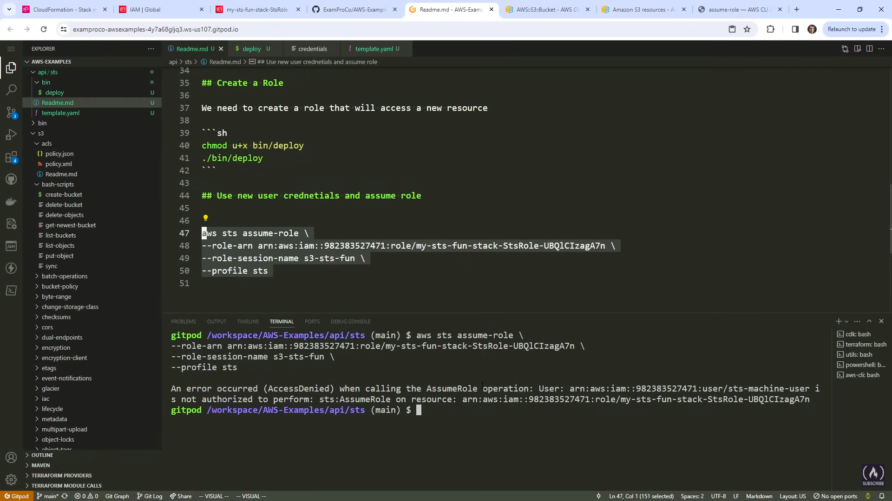
- trying to assume the role for s3 bucket resource using sts profile itself? will that work? I doubt that

AWS validates the request:
- The User check: Does this low-privileged user have permission to call sts:AssumeRole on this specific role ARN? (Yes, we granted that above).
- The Role check: Does the Role’s Trust Policy trust this user? (Yes, it's configured to accept requests from this user).
- AWS then sends back temporary security credentials (an Access Key, Secret Key, and Session Token) that expire in a short time (e.g., 1 hour).

## What is the difference between Role and Policy?
- The easiest way to understand the difference is to think of them as an Identity versus a List of Rules.
- In AWS, an IAM Role is who is performing the action, and an IAM Policy is what they are allowed to do.


## Use new user credentials and assume role
Assuming a role in AWS means temporarily taking on a different identity to gain specific permissions. Instead of giving a user or application permanent access, they request temporary security credentials from the AWS Security Token Service (STS), adopting the exact privileges of that role for a limited time.

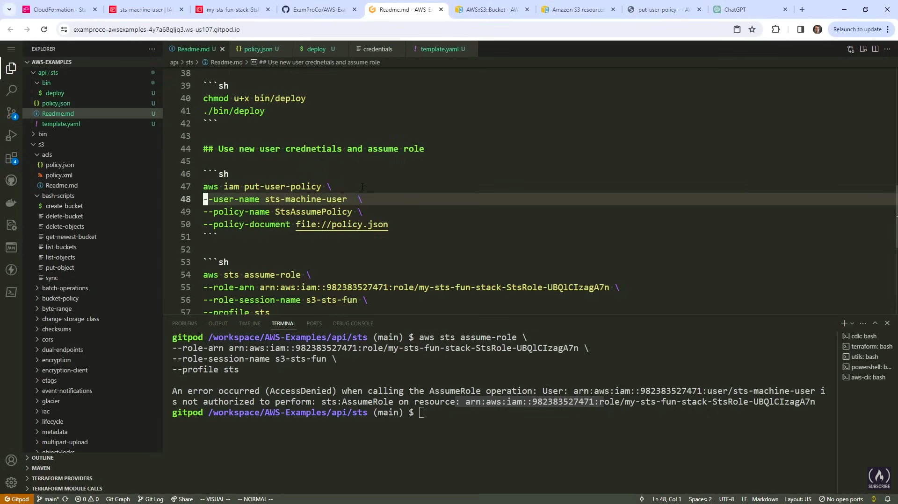

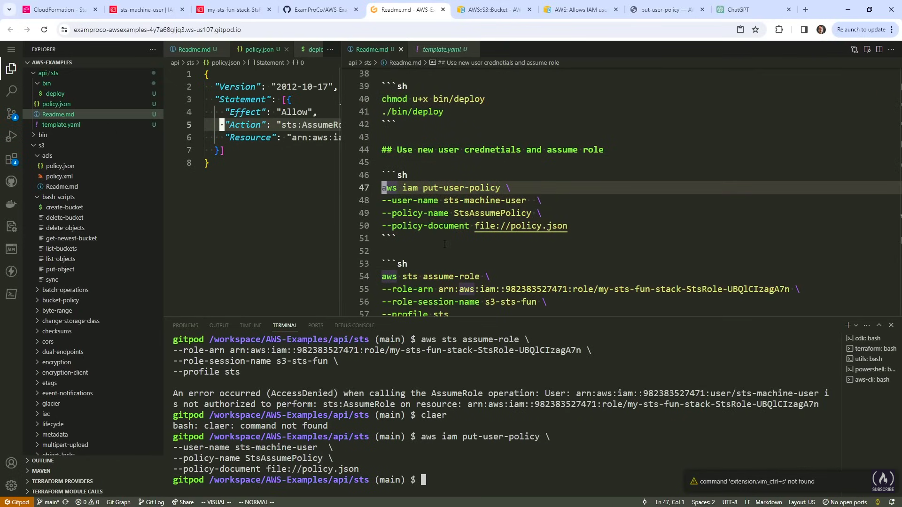

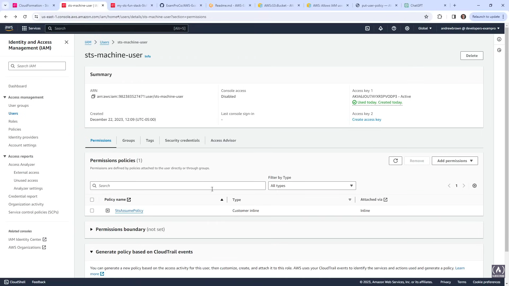

still getting an error
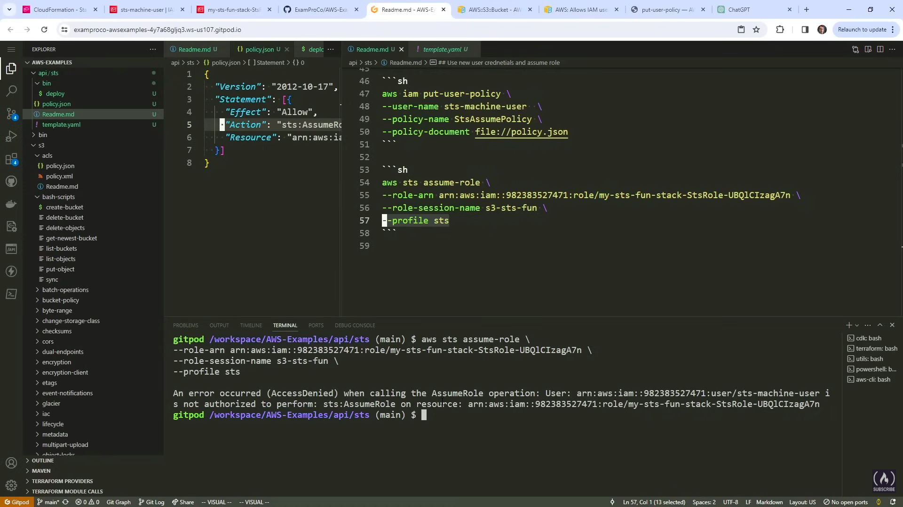

---

trying some principles here  
before:
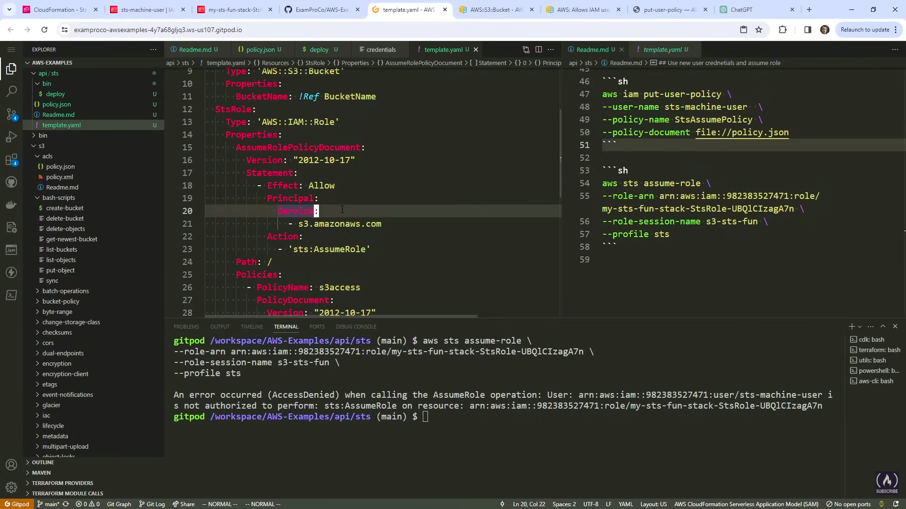
after:
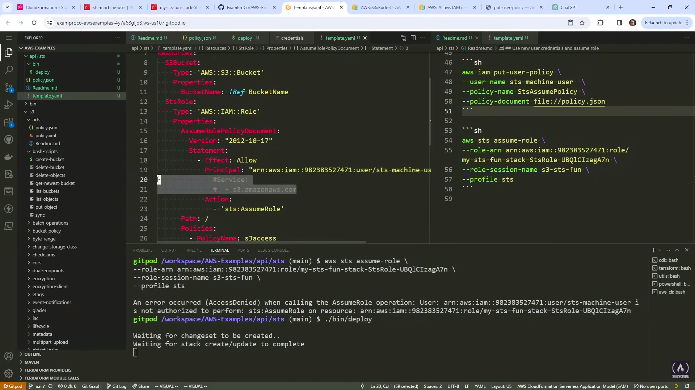
still got error in cfn
---
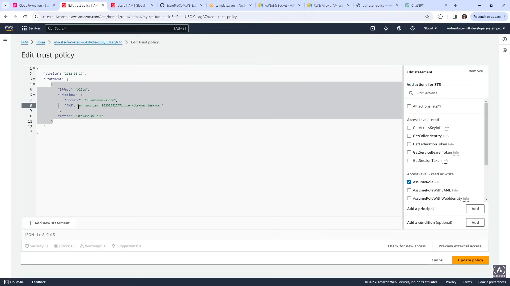
now we can assume that role:
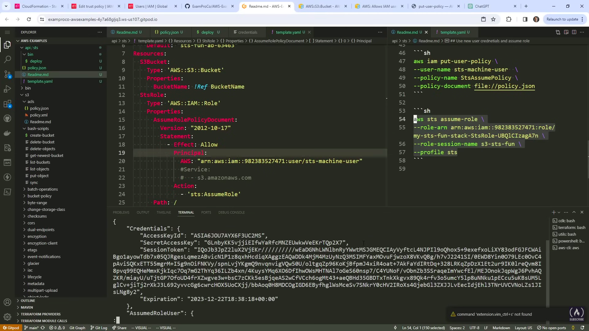

---
Adding the assumed credentials
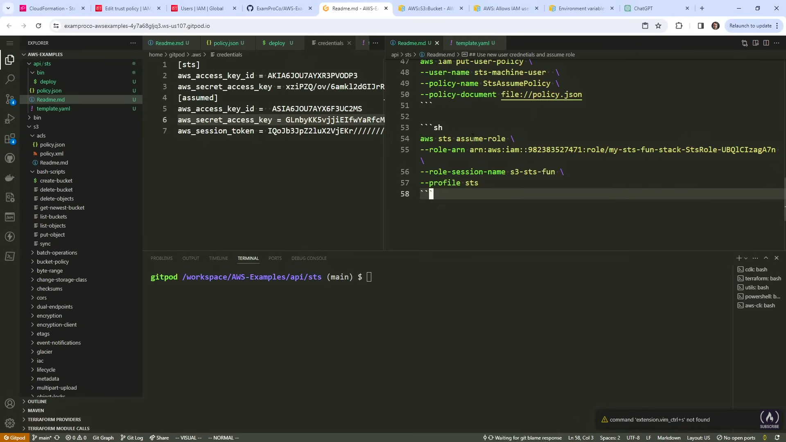

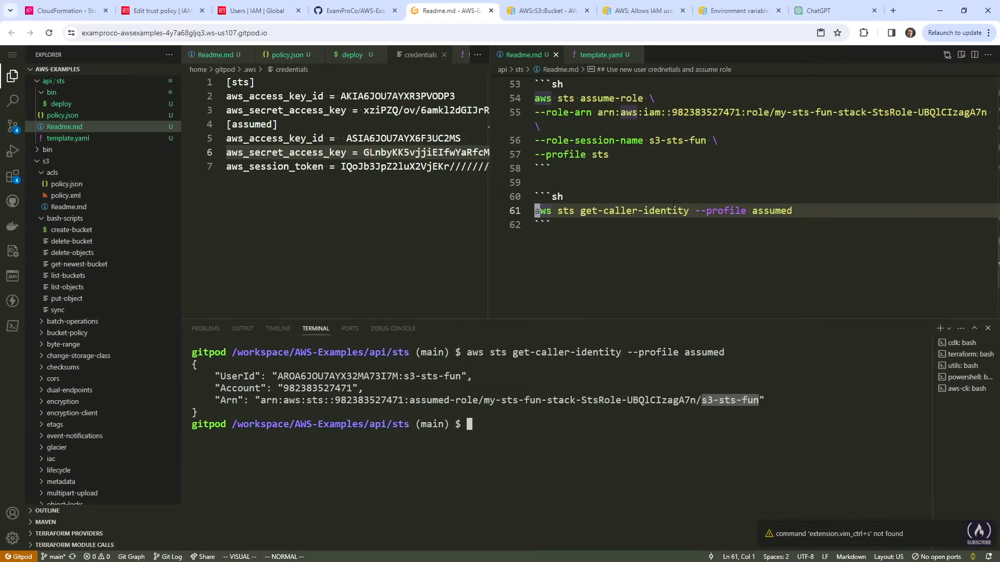

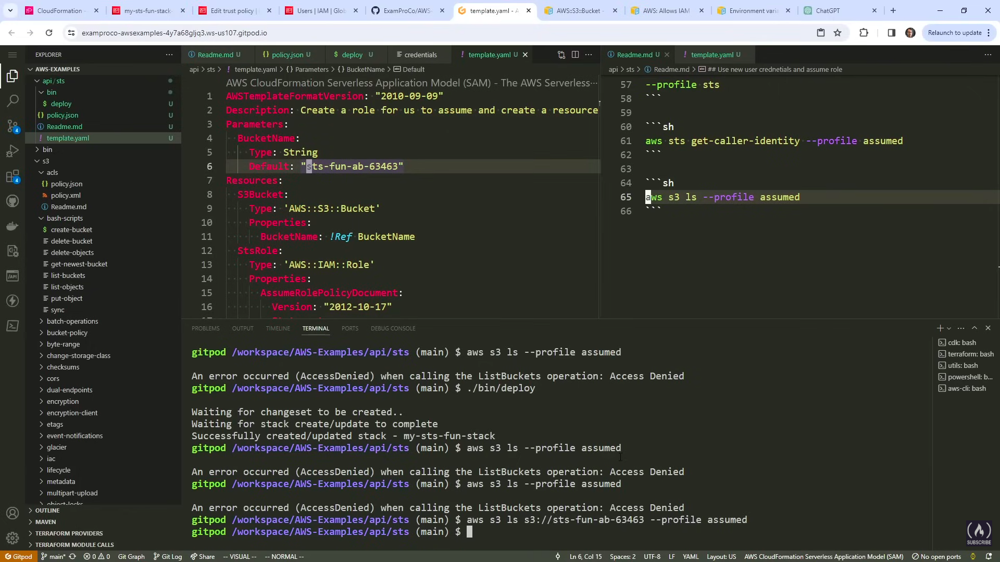

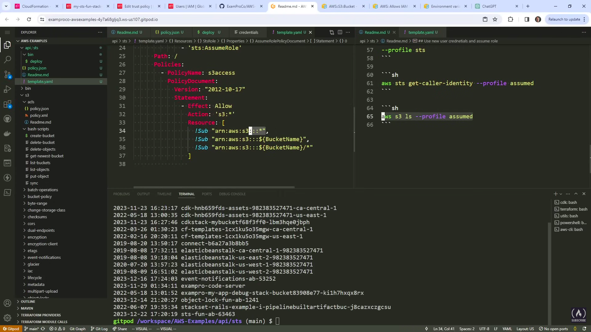
