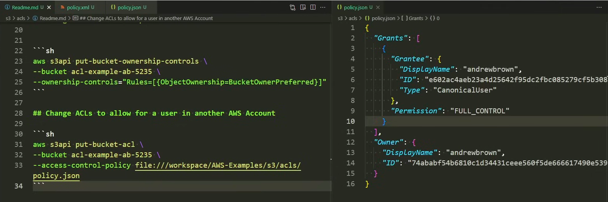

## Create a new Bucket


```sh
aws s3api create-bucket \
  --bucket acl-examples-trat \
  --region ap-south-1 \
  --create-bucket-configuration LocationConstraint=ap-south-1
```

## Turn off the Block Public Access for ACLs

```sh
aws s3api put-public-access-block \
--bucket acl-examples-trat \
--public-access-block-configuration "BlockPublicAcls=false,IgnorePublicAcls=false,BlockPublicPolicy=true,RestrictPublicBuckets=true"
```

### We need to have a second account for testing ACLs However, we can just leave it here

## Get public access configuration details

```sh
aws s3api get-public-access-block --bucket acl-examples-trat
```

## Change Bucket Ownership
https://docs.aws.amazon.com/cli/latest/reference/s3api/put-bucket-ownership-controls.html
```sh
aws s3api put-bucket-ownership-controls \
--bucket acl-examples-trat \
--ownership-controls="Rules=[{ObjectOwnership=BucketOwnerPreferred}]"
```

## Use json based permissions to give ACL access to other account of your bucket resources
https://docs.aws.amazon.com/cli/latest/reference/s3api/put-bucket-acl.html

```json
{
  "Grants": [
    {
      "Grantee": {
        "DisplayName": "string",
        "EmailAddress": "string",
        "ID": "string",
        "Type": "CanonicalUser"|"AmazonCustomerByEmail"|"Group",
        "URI": "string"
      },
      "Permission": "FULL_CONTROL"|"WRITE"|"WRITE_ACP"|"READ"|"READ_ACP"
    }
    ...
  ],
  "Owner": {
    "DisplayName": "string",
    "ID": "string"
  }
}
```

## Now we can easily access this bucket from the another account
