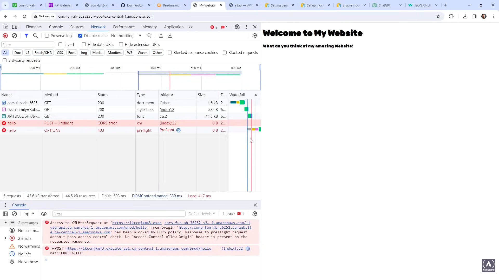
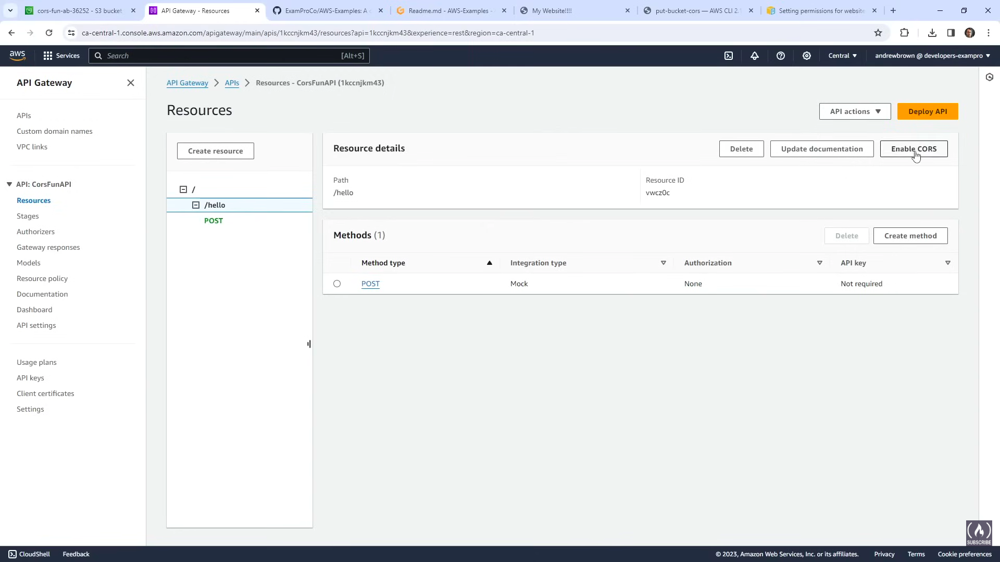
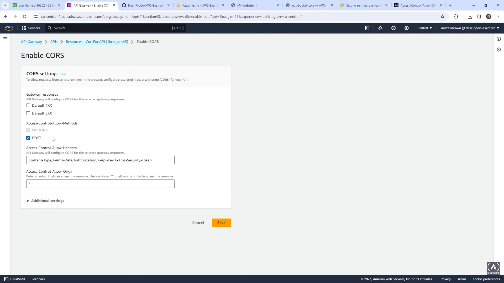
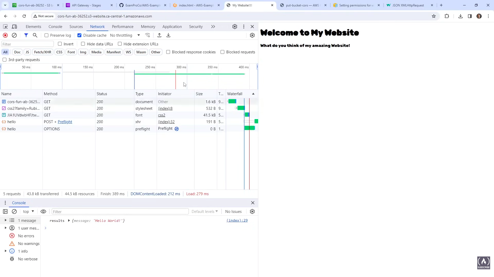

## Create a bucket
```sh
aws s3 mb s3://cors-fun-sa-123
```

## Change block public access
```sh
aws s3api put-public-access-block \
--bucket cors-fun-sa-123 \
--public-access-block-configuration "BlockPublicAcls=true,IgnorePublicAcls=true,BlockPublicPolicy=false,RestrictPublicBuckets=false"
```


## Create a bucket policy
```sh
aws s3api put-bucket-policy --bucket cors-fun-sa-123 --policy file://bucket-policy.json
```


## Turn on static website hosting

```sh
aws s3api put-bucket-website --bucket cors-fun-sa-123 --website-configuration file://website.json
```

## Upload index.html file and include a resource that would be cross origin
```sh
aws s3 cp index.html s3://cors-fun-sa-123
```
## Get the website endpoint for S3
```
http://cors-fun-sa-123.s3-website.ap-south-1.amazonaws.com
```

## Apply a CORS policy


---

# Create another website

## Create a bucket
```sh
aws s3 mb s3://cors-fun2-sa-123
```

## Change block public access
```sh
aws s3api put-public-access-block \
--bucket cors-fun2-sa-123 \
--public-access-block-configuration "BlockPublicAcls=true,IgnorePublicAcls=true,BlockPublicPolicy=false,RestrictPublicBuckets=false"
```


## Create a bucket policy
```sh
aws s3api put-bucket-policy --bucket cors-fun2-sa-123 --policy file://bucket-policy.json
```


## Turn on static website hosting

```sh
aws s3api put-bucket-website --bucket cors-fun2-sa-123 --website-configuration file://website.json
```

## Upload index.html file and include a resource that would be cross origin
```sh
aws s3 cp index.html s3://cors-fun2-sa-123
```
## Get the website endpoint for S3
```
http://cors-fun-sa-123.s3-website.ap-south-1.amazonaws.com/
http://cors-fun2-sa-123.s3-website.ap-south-1.amazonaws.com/
```

## Apply a CORS policy

To do this we initially tried different methods to get the CORS issue but didn't succeed because the google font endpoints are apparently smart enough to mitigate this on its own, then we tried creating an rest api endpoint which will run a simple javascript when trigerred and after that the CORS issue occurred.


So, we need to resolve this created CORS now, to do that we need to set a CORS policy from here: https://docs.aws.amazon.com/cli/latest/reference/s3api/put-bucket-cors.html

```json
aws s3api put-bucket-cors --bucket amzn-s3-demo-bucket --cors-configuration file://cors.json

cors.json:
{
  "CORSRules": [
    {
      "AllowedOrigins": ["http://www.example.com"],
      "AllowedHeaders": ["*"],
      "AllowedMethods": ["PUT", "POST", "DELETE"],
      "MaxAgeSeconds": 3000,
      "ExposeHeaders": ["x-amz-server-side-encryption"]
    },
    {
      "AllowedOrigins": ["*"],
      "AllowedHeaders": ["Authorization"],
      "AllowedMethods": ["GET"],
      "MaxAgeSeconds": 3000
    }
  ]
}
```

and after configuring this CORS policy on the bucket we also need to configure on the API gateway we created because it expects some unique headers upon the API request to our created endpoint.





