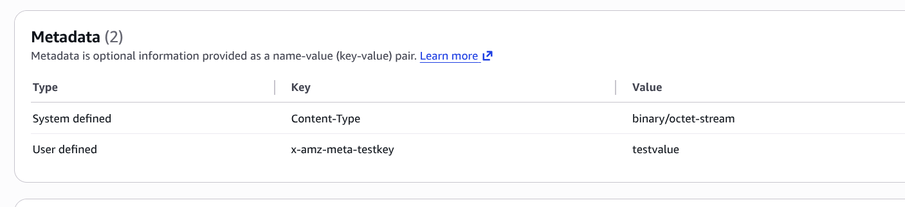

# Create a bucket
```sh
aws s3 mb s3://metadata-fun-ab-129
```
- Metadata related information inside the put-object function
https://docs.aws.amazon.com/cli/latest/reference/s3api/put-object.html

# Create a new file

```sh
echo 'hello world' > hello.txt
```

# Upload file with metadata
```sh
aws s3api put-object --bucket metadata-fun-ab-129 --key hello.txt --metadata testkey=testvalue --body hello.txt
```

# Get metadata

```sh
aws s3api head-object --bucket metadata-fun-ab-129 --key hello.txt
```

```sh
hp@pop-os:~/Desktop/aws/s3/metadata$ aws s3api head-object --bucket metadata-fun-ab-129 --key hello.txt
{
    "AcceptRanges": "bytes",
    "LastModified": "Mon, 15 Jun 2026 06:53:04 GMT",
    "ContentLength": 12,
    "ETag": "\"6f5902ac237024bdd0c176cb93063dc4\"",
    "ContentType": "binary/octet-stream",
    "ServerSideEncryption": "AES256",
    "Metadata": {
        "testkey": "testvalue"
    }
}
```

### Notice that we've the metadata fields here but not the mandatory prefix, so these days aws automatically applies it for us


