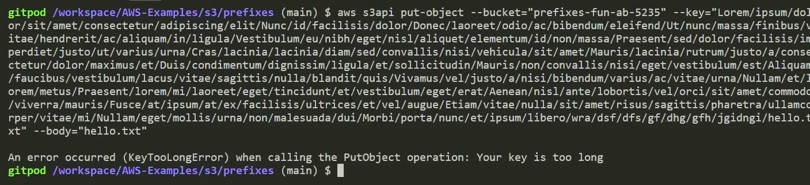

## Create bucket
```sh
aws s3 mb s3://prefixes-fun-asdjl23
```

## Create out folder
```sh
aws s3api put-object \
--bucket prefixes-fun-asdjl23 \
--key hello/
```
## 1024 bytes is the limit of the size of any prefix
- But can we upload an object in such a bucket? Nope :)


